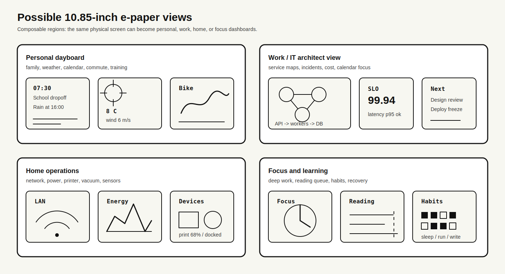

<h1 align="center">Waveshare e-Paper 10.85 Dashboard</h1>

<p align="center">
  A Raspberry Pi Zero 2W dashboard for the Waveshare 10.85-inch e-paper panel. It renders glanceable home, device, and usage data with local configuration and careful partial refreshes.
</p>

<p align="center">
  <a href="https://github.com/bjadda/Waveshare-ePaper-10.85-dashboard"></a>
  <a href="https://github.com/bjadda/Waveshare-ePaper-10.85-dashboard/issues"></a>
  <a href="https://github.com/bjadda/Waveshare-ePaper-10.85-dashboard/pulls"></a>
  <a href="https://github.com/bjadda/Waveshare-ePaper-10.85-dashboard/commits/main"></a>
</p>

<p align="center">
  <a href="https://github.com/bjadda/Waveshare-ePaper-10.85-dashboard"><strong>Repository</strong></a> |
  <a href="https://github.com/bjadda/Waveshare-ePaper-10.85-dashboard/issues/new"><strong>Report an issue</strong></a> |
  <a href="https://github.com/bjadda/Waveshare-ePaper-10.85-dashboard/fork"><strong>Fork</strong></a> |
  <a href="CONTRIBUTING.md"><strong>Contribute</strong></a>
</p>

| Primary dashboard | Fallback dashboard |
| --- | --- |
|  |  |

## What It Does

- Runs on a Raspberry Pi Zero 2W with the Waveshare 10.85-inch e-paper panel.
- Uses a patched local driver for safer rectangular partial refreshes.
- Lets you choose widgets and slot rotation through a local web configurator.
- Shows home, device, weather, usage, network, and productivity widgets.
- Keeps secrets local in ignored runtime files.
- Falls back to logs when a widget, API, or hardware refresh misbehaves.

## Install

Run this on the Raspberry Pi:

```bash
curl -sSL https://raw.githubusercontent.com/bjadda/Waveshare-ePaper-10.85-dashboard/main/install.sh | bash
```

The installer enables SPI, installs dependencies, writes `dashboard_config.json`, and creates the `epaper-dashboard` systemd service.

Hardware:

- Raspberry Pi Zero 2W
- Waveshare 10.85-inch e-Paper HAT+
- SPI enabled on Raspberry Pi OS

## Case And Assembly

- 3D printed case: [MakerWorld model](https://makerworld.com/en/models/2322517-epaper-dashboard-waveshare-10-85).
- Assembly video: [YouTube guide](https://youtu.be/H964RpaJvu0).

## Configure

Start the local configurator from the installed dashboard directory:

```bash
cd ~/dashboard
python3 config_server.py --host 0.0.0.0 --port 8080
```

Open `http://<pi-ip>:8080` from a browser on the same trusted network. The configurator writes `dashboard_config.json`.

Restart after saving:

```bash
sudo systemctl restart epaper-dashboard
```

Manual config starts from `config/dashboard_config.example.json`. Detailed widget setup lives in [docs/WIDGETS.md](docs/WIDGETS.md), and visual asset guidance lives in [docs/ASSETS.md](docs/ASSETS.md).

## Run And Debug

Useful service commands:

```bash
sudo systemctl status epaper-dashboard
sudo systemctl restart epaper-dashboard
journalctl -u epaper-dashboard -f
```

When in doubt, fall back to logs:

- `journalctl -u epaper-dashboard -f` for systemd output.
- `~/dashboard/dashboard.log` for the main render loop.
- `~/dashboard/claude_monitor.log`, `~/dashboard/openai_monitor.log`, and `~/dashboard/limits.log` for usage widgets.
- Run `python3 main.py` in the foreground when an OAuth flow or first-run prompt needs attention.

## Dashboard Ideas



Examples of what the same slot system can support:

- Personal dayboard: weather, calendar, training, chores, commute, reminders.
- Work or IT architecture: SLOs, incidents, deploy windows, cloud spend, focus blocks.
- Home operations: network, solar or power use, sensors, NAS, printer, vacuum, backups.
- Focus and learning: timer, reading queue, habits, recovery, daily notes.

The editable visual source is [docs/visualization-ideas.svg](docs/visualization-ideas.svg).

## Project Map

| Path | Purpose |
| --- | --- |
| `main.py` | Runtime loop, data fetching, and e-paper rendering. |
| `config_server.py` | Local accessible web configurator. |
| `dashboard/` | Widget rendering, config helpers, and usage-provider scripts. |
| `config/` | Safe sample runtime config. |
| `docs/` | Widget setup, asset gallery, and references that do not need to crowd the README. |
| `lib/waveshare_epd/` | Bundled Waveshare driver with the local 10.85 partial-refresh patch. |
| `systemd/` | Service template installed by `install.sh`. |
| `tools/` | Small maintainer scripts, including the generated icon/font gallery. |

## Participate

Issues, experiments, hardware test notes, widget ideas, and small cleanup PRs are welcome. Start with [CONTRIBUTING.md](CONTRIBUTING.md), and read [SECURITY.md](SECURITY.md) before posting logs, configs, or credentials.

Project credit is tracked in [CREDITS.md](CREDITS.md). The original repository is [`czuryk/Waveshare-ePaper-10.85-dashboard`](https://github.com/czuryk/Waveshare-ePaper-10.85-dashboard).