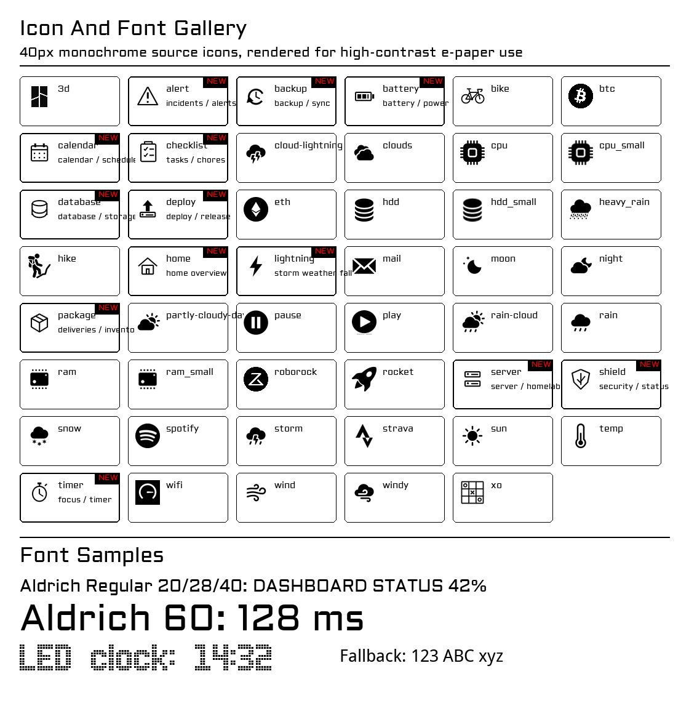

# Icons And Fonts

The dashboard uses simple monochrome assets because the 10.85-inch e-paper panel rewards clarity over detail. Icons should read at 30-60px, survive 1-bit conversion, and still make sense after a partial refresh.



## Compatible Icon Direction

Use icons for repeatable dashboard concepts, not decoration. Good candidates are things a user can scan in one second:

- Personal: calendar, package, checklist, timer, home.
- Work / IT architecture: server, database, deploy, backup, alert.
- Home operations: battery, shield, network, printer, storage, weather.

The current generated expansion adds:

| Icon | Suggested use |
| --- | --- |
| `icon_alert.bmp` | Incidents, urgent sensor state, service alarms. |
| `icon_calendar.bmp` | Calendar, schedule, upcoming event. |
| `icon_package.bmp` | Deliveries, inventory, shopping list. |
| `icon_battery.bmp` | Battery, UPS, solar, energy storage. |
| `icon_server.bmp` | Homelab, service host, NAS, compute node. |
| `icon_database.bmp` | Database, storage, backups, data health. |
| `icon_shield.bmp` | Security, lock state, VPN, safe/unsafe status. |
| `icon_deploy.bmp` | Deployments, releases, CI/CD windows. |
| `icon_backup.bmp` | Backup, sync, restore point. |
| `icon_checklist.bmp` | Tasks, chores, routines, reminders. |
| `icon_home.bmp` | Home overview, rooms, household status. |
| `icon_timer.bmp` | Focus timer, countdown, elapsed work block. |
| `icon_lightning.bmp` | Weather-code fallback for thunderstorms. |

## Icon Rules

- Name files `icons/icon_name.bmp` so runtime calls use `icon_name`.
- Keep source icons black on white. The runtime inverts and draws them as 1-bit bitmaps.
- Design at 40x40px with generous padding.
- Avoid thin diagonal detail below 2px at source size.
- Prefer filled symbols plus a few strong outlines.
- Test at 30px, 40px, 50px, and 60px before wiring a widget to a new icon.

## Font Roles

| Font | Current role |
| --- | --- |
| `Aldrich-Regular.ttc` | Main dashboard labels, widget titles, values. |
| `advanced_led_board-7.ttc` | Large clock display. |
| `Font.ttc` | Broad fallback font for characters not covered by the dashboard face. |

Keep new UI text short. The display is large, but dense status dashboards still need breathing room.

## Regenerate Assets

Generated icons and the gallery come from `tools/generate_asset_gallery.py`:

```bash
python3 tools/generate_asset_gallery.py
```

Run it after changing generated icon shapes or adding another generated icon. Existing hand-supplied icons can stay as they are.